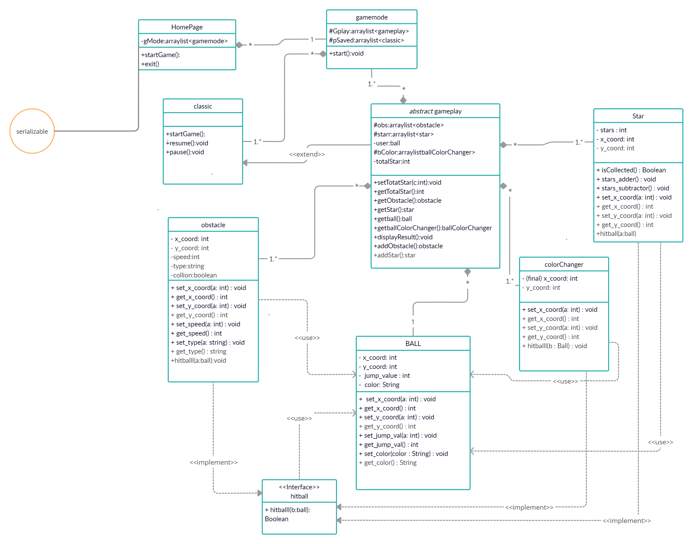
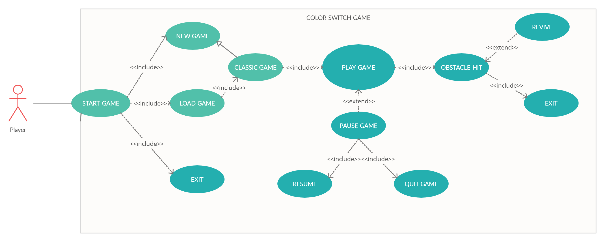

# ApFinalProject
We have created a Color Switch game, featuring numerous hidden adventures that make it truly unique!

I, Anurag Yadav, along with my project partner Yash Aggarwal, developed this project using JavaFX. We have incorporated various OOP principles to enhance its functionality and structure.
To ensure a well-planned approach, we designed a UML diagram to outline our development process and a Use Case diagram to visualize the final product clearly.
We hope you like it! 🚀

HOPE YOU LIKE IT!

