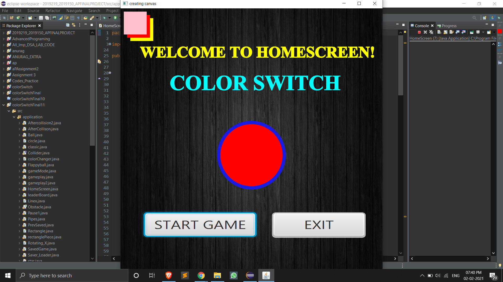
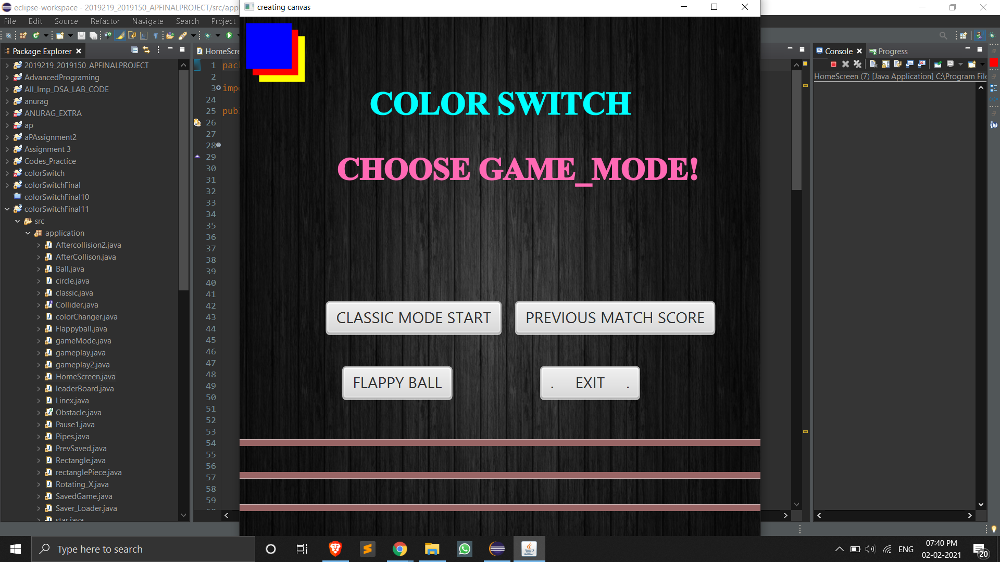
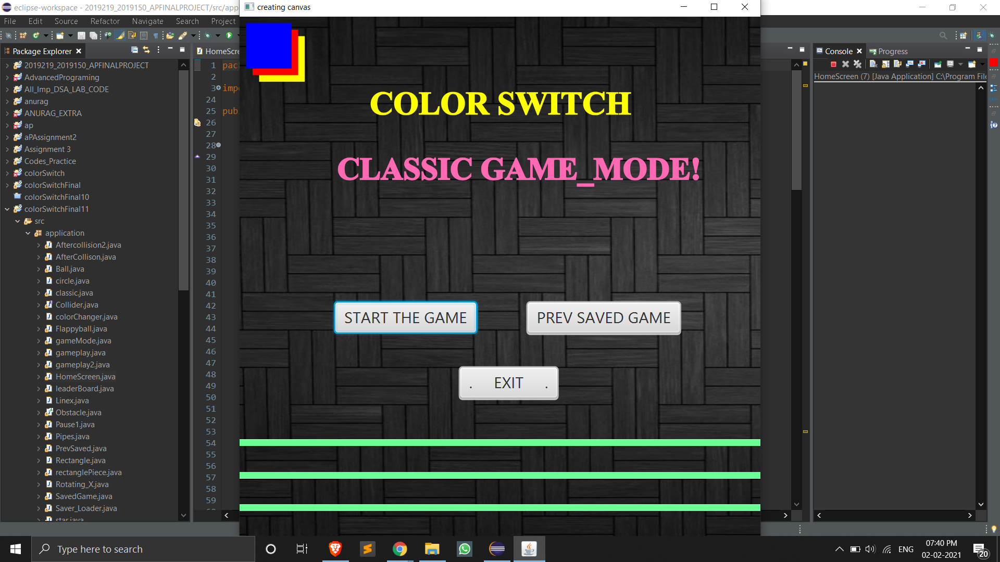
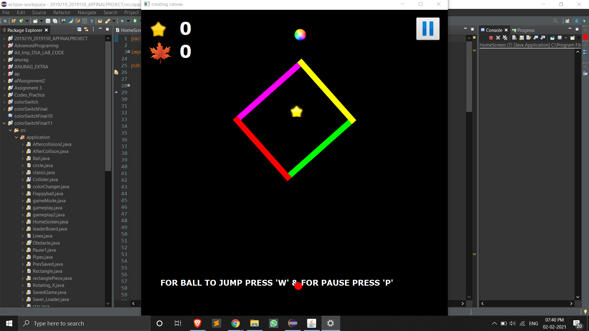
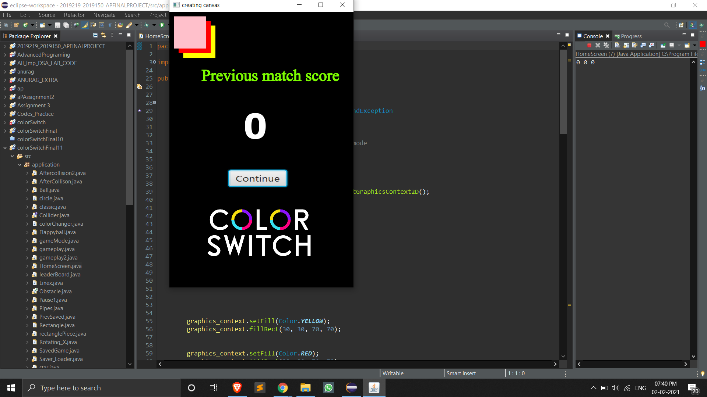
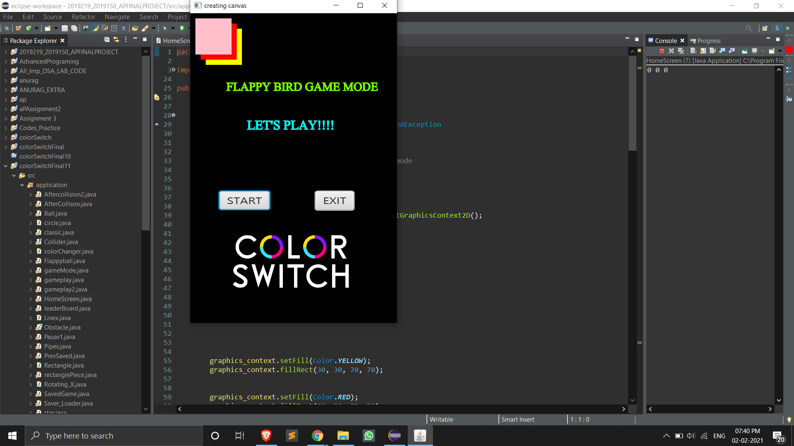
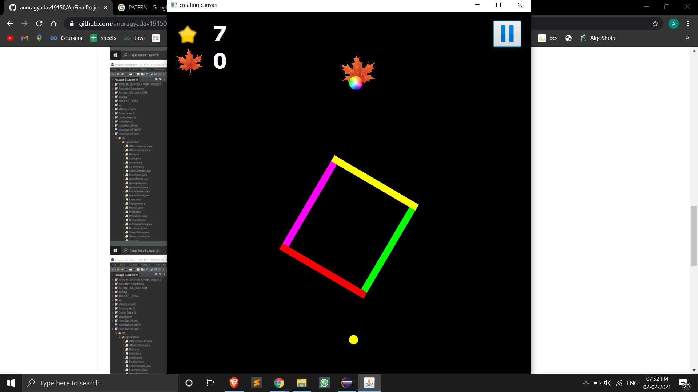
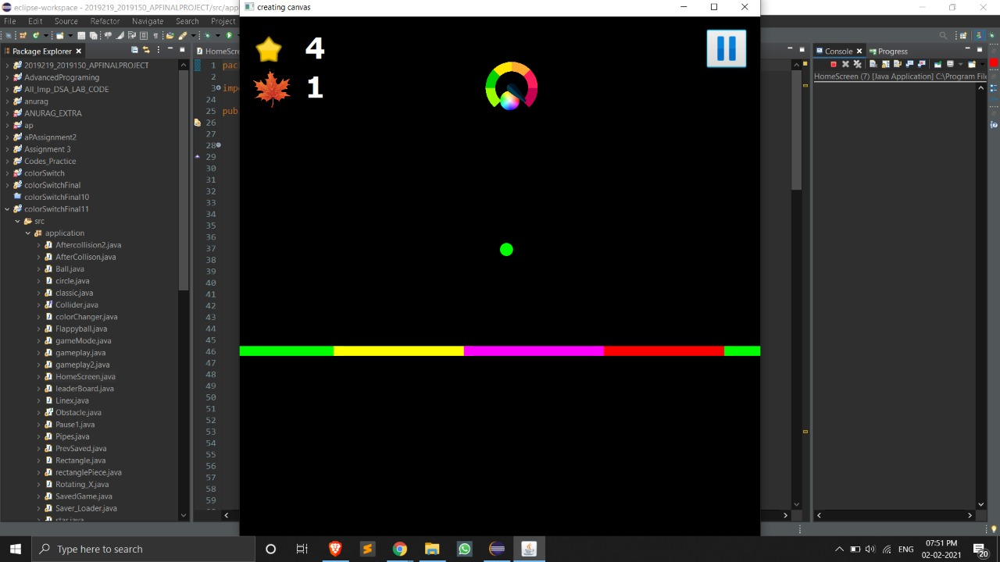
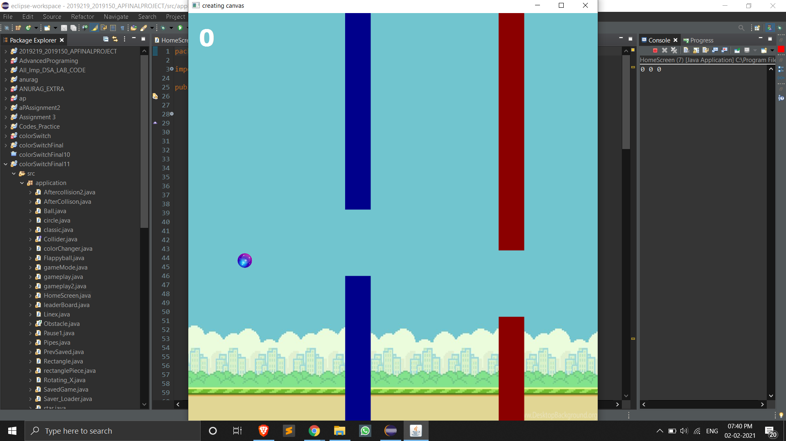

# ApFinalProject
WE HAVE MADE AN COLOR SWITCH GAME , 
IT HAS MANY HIDDEN ADVENTURES WHICH MAKE IT UNIQUE. !!
I ANURAG YADAV WITH MY PROJECT PARTNER YASH AGGARWAL HAS MADE THIS PROJECT USING JAVAFX.  !!
WE HAVE USED MANY OOP'S FEATURES TO MAKE THIS PROJECT

WE ALSO HAVE MADE THE UML DIAGRAM SO THAT WE CAN PLAN HOW WE ARE GOING TO DO THIS PROJECT 
AND ALSO A USE CASE DIAGRAM SO THAT WE HAVE A CLEAR PICTURE OF THE FINAL PRODUCT IN OUR MIND

HOPE YOU LIKE IT!

